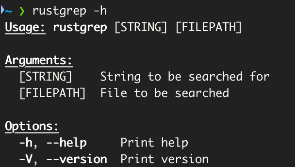

# Rustgrep - grep written in Rust

Rustgrep is the linux command-line tool "grep" rewritten in Rust with basic features.  
If grep is unfamiliar to you check out: [How To Geek: grep](https://www.howtogeek.com/496056/how-to-use-the-grep-command-on-linux/).

## About

I created this project in order to learn Rust. Therefore it is by far not mature or comparable to grep in this stage.  
With this project I am trying to learn the concepts of Rust and also enhance my knowledge about software engineering in general.  
Furthermore it should serve for other Rust Beginners as an oppurtunity to learn Rust and learn from other peoples code.

## Goals 🚀

- Let rustgrep be a fully functional substitution to the original grep
- Create a standalone cli tool from this project.
- To let collaborators have fun while learning rust on this project

## Contribute 👨🏼‍💻👩🏼‍💻

To contribute to this project: 
1. Pick/Create an issue
2. Fork the repository
3. Resolve the issue and push
4. Create a Pull Request

Some general Do's:  
✅ Only contribute with references to existing issues (or suggest a new issue if you found something you want to work on).   
✅ Don't forget to comment out your code and explain what it does.  
✅ Write descriptive commit messages and reference the issue number.  
✅ If you found an issue for you, comment that you want to work on it so it can be assigned to you.  
✅ Be patient ... this is a side project for me too and altough I am trying to be quick with approvals and support, it can take some time still.  

Thank you for your contribution and I hope you have fun with this project! :) 

## Install

> Rustup & Cargo must be installed before installing rustgrep

1. Download Code from GitHub
2. Open Project in Code Editor or navigate to the rustgrep folder in your terminal
3. Type the following command in your terminal: `cargo build --release`
4. Navigate to `rustgrep/target/rustgrep` this is the rustgrep executable
5. Add the path to the executable to your environment variables and give it the alias "rustgrep"

To check if installation was successful open your terminal and type: `rustgrep -h` 
The output should look similar to this: 

## Crates used
- [Clap](https://docs.rs/clap/latest/clap/)
- [Regex](https://docs.rs/regex/latest/regex/)
